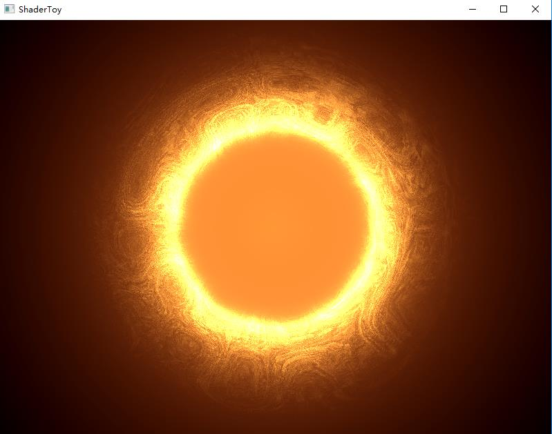
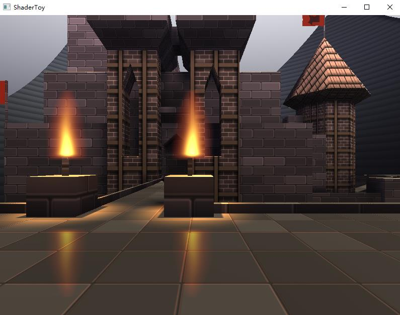

# Simple C++ OpenGL Framework for executing fragment shaders on ShaderToy
 
## sample result screenshots：
* screenshot1

* screenshot2

## dependencies
* GLFW
* GLEW
* ASSIMP for loading simple obj model
* GLM
